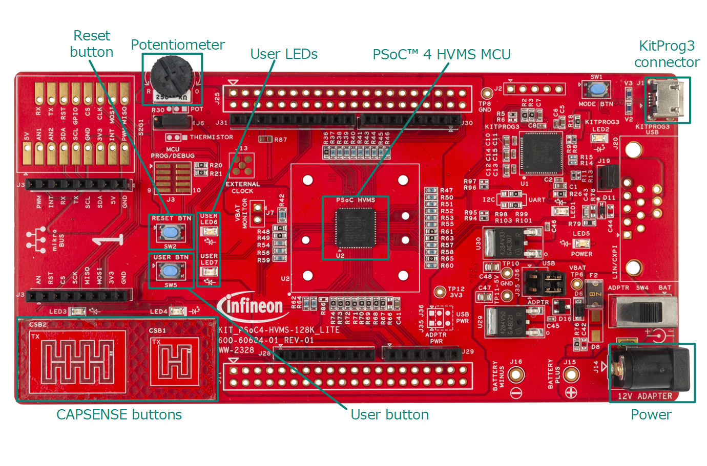
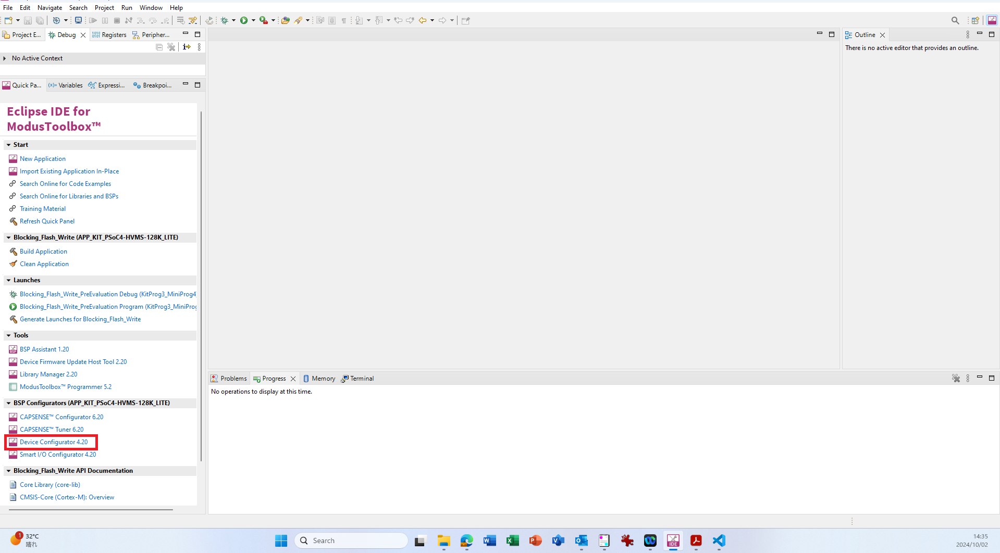
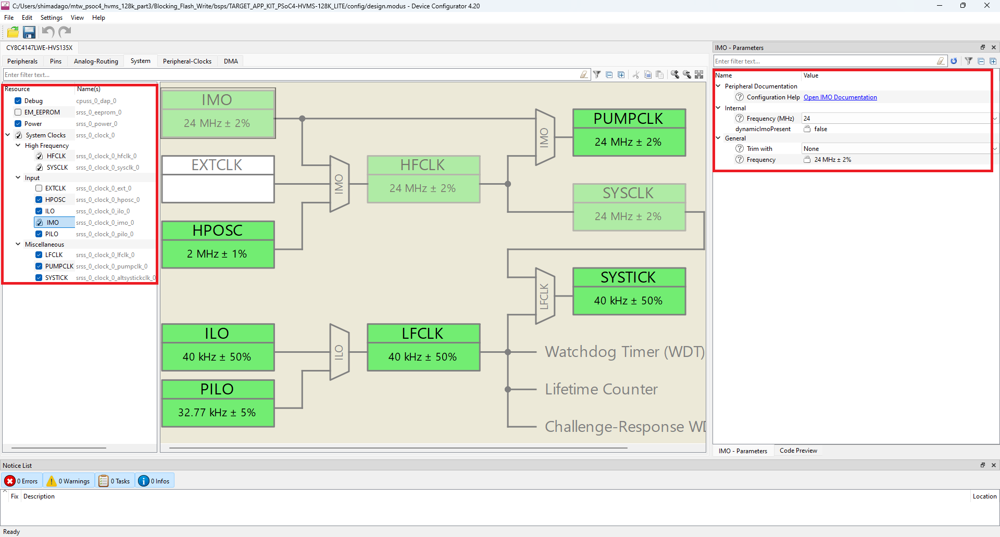
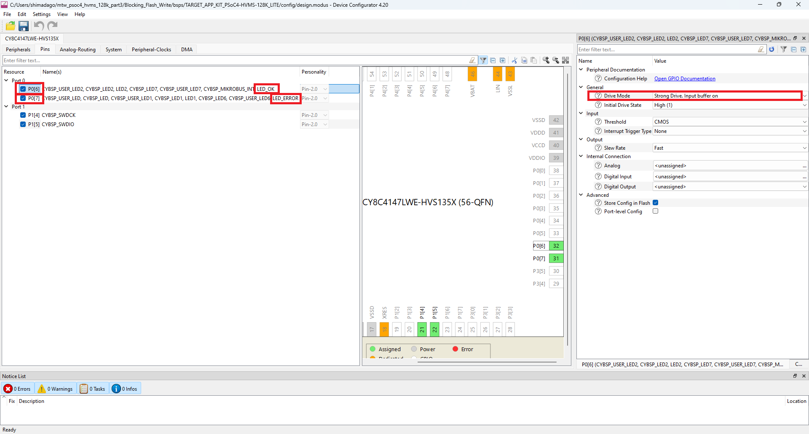
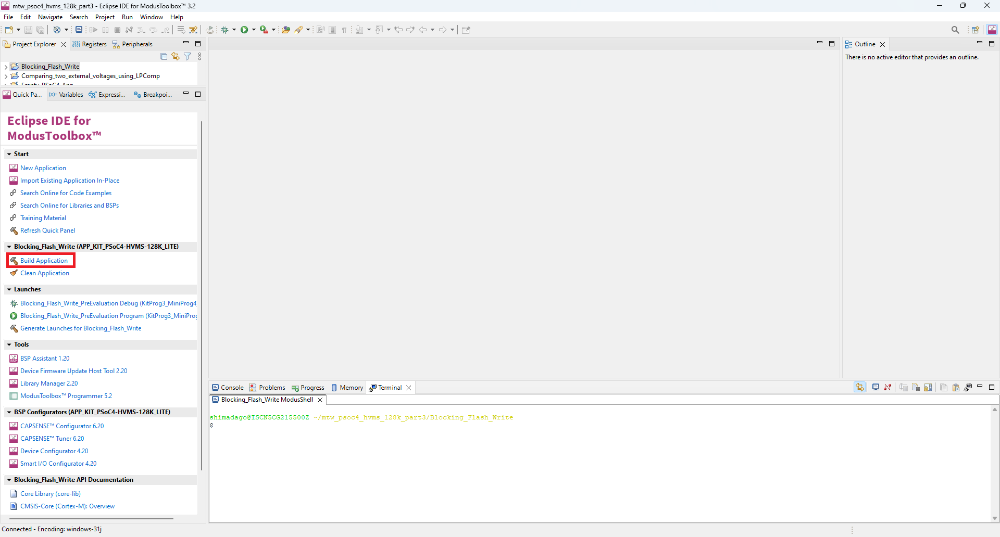

# PSOC&trade; 4: Blocking Flash Write
**This code example shows how to write flash memory row.**

## Device
The device used in this code example (CE) is:
- [PSOC™ 4 HVMS Series (High Voltage Mixed Signal)](https://www.infineon.com/cms/en/product/microcontroller/32-bit-psoc-arm-cortex-microcontroller/32-bit-psoc-4-hv-arm-cortex-m0/)

## Board
The board used for testing is:
- PSOC&trade; 4 HVMS Lite Kit ([KIT_PSoC4-HVMS-128K_LITE](https://www.infineon.com/cms/en/product/evaluation-boards/kit_psoc4-hvms-128k_lite/))
- PSOC&trade; 4 HVMS Lite Kit ([KIT_PSoC4-HVMS-64K_LITE](https://www.infineon.com/cms/en/product/evaluation-boards/kit_psoc4-hvms-64k_lite/))

## Scope of work
This code example writes 128 bytes data in a row of flash memory area using Write row System call. Then, when System call operation success and, source and destination data match, LED7 turns on. If System call operation fails or, source and destination data do not match, LED6 turns on.

## Introduction  
PSOC™ HV MS flash memory has the following features:

- Supports AEC-Q100 Automotive Grade 1 temperature range (Ambient temperature = –40°C to 125°C)
- Up to 64 KB (MS-64K)/ 128 KB (MS-128K) of flash with error correction code (ECC)
- 1 KB of SFlash for trimming and wounding information with ECC
- Flash macro data: 72-bit width (64-bit data + 8-bit parity)
-  ECC parity calculated in hardware
   - Erased flash (all zeros) will not cause ECC errors on read
   - Eight ECC bits allow a single error correction and double error detection
   - ECC error injection
-  Implement flash write protect register
-  Flash controller with data buffers to accelerate flash memory accesses
-  System performance controller interface (SPCIF) with ECC provides program and erase functionality
-  Flash endurance: 100 K cycles at 85°C ambient, 10 K cycles at 125°C ambient
-  Program disturb: 100 K cycles at 125°C ambient
-  Data retention: Up to 15 years
-  Core power supply: VCCD = 1.8 V

More details can be found in:
- PSOC&trade; 4 HVMS Series
  - [Architecture Reference manual](https://www.infineon.com/dgdl?fileId=8ac78c8c93dda25b0195297d34bf3ee6&da=t)
  - [Registers Reference manual (PSOC&trade; 4 HVMS 64K)](https://www.infineon.com/dgdl/?fileId=8ac78c8c93dda25b019562232806264b)
  - [Registers Reference manual (PSOC&trade; 4 HVMS 128K)](https://www.infineon.com/dgdl/?fileId=8ac78c8c95650102019567b74fb62a38)
  - [Data Sheet (PSOC&trade; 4 HVMS 64K)](https://www.infineon.com/dgdl/?fileId=8ac78c8c956a0a470195817712a75d7a)
  - [Data Sheet (PSOC&trade; 4 HVMS 128K)](https://www.infineon.com/dgdl/?fileId=8ac78c8c956a0a47019581095cec5cf6)

## Hardware setup

This Code Example has been developed for:
- [KIT_PSOC4-HVMS-128K_LITE](https://www.infineon.com/cms/en/product/evaluation-boards/kit_psoc4-hvms-128k_lite/) 
- [KIT_PSOC4-HVMS-64K_LITE](https://www.infineon.com/cms/en/product/evaluation-boards/kit_psoc4-hvms-64k_lite/) 

**Figure 1. KIT_PSOC4-HVMS-128K_LITE (Top View)**
  

## Implementation

The firmware is implemented in *main.c* and performs the following functions:

1. Define the size of the flash memory row and initialize data to write
2. Initialize and board peripherals
3. Set the write data
4. Configure LEDs for results (LED_OK / LED_ERROR)
5. Write data to flash memory row and confirm read data
6. Confirm results on the LED_OK (User LED7) or LED_ERROR (User LED6)

**ModusToolbox&trade; Device configurator**

This code example project can be created or imported using ModusToolbox&trade; IDE. To configure the project in the **Quick Panel**, click on **Device Configurator**    

**Figure 2. Select Device Configurator**
  

**Figure 3. System Clock Settings**
  

**Figure 4. Pins Settings**
  

The basic idea is to set the data to be written and the flash row to which it should be written, and execute flash memory write/read access.

- Using <i>memset</i> to set the source data.
- Using <i>memcmp</i> to compare the written value with the value written in the destination flash memory address.
- <a href="https://infineon.github.io/mtb-pdl-cat2/pdl_api_reference_manual/html/group__group__gpio__functions__gpio.html#ga849c813d6771bf8d3c59b89b28a07bca"><i>Cy_GPIO_Write();</i></a> reflects the states of flash row access on the LED (LED_OK/LED_ERROR).
- Using to erase a flash row and programs it with the new data by <a href="https://infineon.github.io/mtb-pdl-cat2/pdl_api_reference_manual/html/group__group__flash__functions.html#gafaa220a63444c4e5a5abe9b8c2cec721"><i>Cy_Flash_WriteRow()</i></a>.
- Define the size of the flash memory by <a href="https://infineon.github.io/mtb-pdl-cat2/pdl_api_reference_manual/html/group__group__flash__config__macros.html#ga9f89f81ee572c6f08c8fb4fb0abed62d"><i>CY_FLASH_SIZEOF_FLASH</i></a>.
- <a href="https://infineon.github.io/mtb-pdl-cat2/pdl_api_reference_manual/html/group__group__flash__enumerated__types.html#ggae3ceedae602af2dd75864cf38246f496a897d5be5e24dc4bc3dd18fed0dc46b02"><i>CY_FLASH_DRV_SUCCESS</i></a> is an enumerator when the status of the System call is success.

## Compiling and programming
Before testing this code example:  
- Power the board through the dedicated power connector 
- Connect the board to the PC through the USB interface
- Build the project using the dedicated Build button
 

**Figure 5. Build Project**
   or by right-clicking the project name and selecting "Build Project"
- To program the board, in the **Quick Panel**, scroll down, and click **[Project Name] Program (KitProg3_MiniProg4)**

## Run and Test

- After programming, the code example will start automatically and  flash row access result is displayed to LED. If LED_OK (User LED7) lights then it passed, when LED_ERROR (User LED6) lights then it failed.

- You can debug the example to step through the code. In the IDE, use the **[Project Name] Debug (KitProg3_MiniProg4)** configuration in the **Quick Panel**. For details, see the "Program and debug" section in the [Eclipse IDE for ModusToolbox&trade; software user guide](https://www.cypress.com/MTBEclipseIDEUserGuide).

**Note:** **(Only while debugging)** On the CM7 CPU, some code in *main()* may execute before the debugger halts at the beginning of *main()*. This means that some code executes twice: once before the debugger stops execution, and again after the debugger resets the program counter to the beginning of *main()*. See [KBA231071](https://community.cypress.com/docs/DOC-21143) to learn about this and for the workaround.

## References  
Relevant Application notes are:
- [AN0034 - Getting started with PSOC&trade; 4 HV MS MCUs in ModusToolbox&trade;](https://www.infineon.com/dgdl?fileId=8ac78c8c93dda25b01954cc962534907)

ModusToolbox&trade; is available online:
- <https://www.infineon.com/modustoolbox>

Associated PSOC&trade; 4 HVMS MCUs can be found on:
- <https://www.infineon.com/cms/en/product/microcontroller/32-bit-psoc-arm-cortex-microcontroller/32-bit-psoc-4-hv-arm-cortex-m0/>

More code examples can be found on the GIT repository:
- <https://github.com/Infineon/Code-Examples-for-ModusToolbox-Software>

For additional trainings, visit our webpage:  
- <https://www.infineon.com/cms/en/product/microcontroller/32-bit-psoc-arm-cortex-microcontroller/32-bit-psoc-4-hv-arm-cortex-m0/#!trainings>

For questions and support, use the PSOC&trade; 4 HVMS Forum:  
- <https://community.infineon.com/t5/PSoC-4/bd-p/psoc4>

